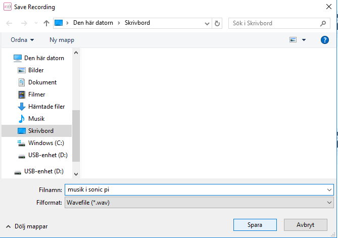

# Spara musik i Sonic-Pi

Det här är en introduktion till <a href="http://sonic-pi.net/" target="_blank"> **Sonic Pi**</a>, ett programmeringsspråk där du kan programmera musik. Här visar vi hur du sparar din musik som du har kodat.

Musiken som du skapar i Sonic Pi kan du sedan till exempel använda i projekt som du gör i Scratch eller i något annat programmeringsspråk!

## 1: Spara din musik
Så här gör du när du är klar med ett musikprogram i Sonic Pi och vill spara musiken som en ljudfil.

1. Klicka på REC-knappen. Då spelas musiken in när du kör ditt musikprogram.

2. Klicka på RUN för att spela upp musiken. Nu är inspelningen igång!

3. Klicka på REC igen när du vill stoppa inspelningen.

4. När du har avslutat inspelningen vill programmet att du sparar din musikfil. Välj den **mapp** där du vill att filen sparas. **Döp filen** och tryck på **spara**.

## Färdig!
Grattis, nu har du sparat din musik! Nu kan du använda den till att ljudsätta något projekt som du har skapat, till exempel Scratch-uppgiften <a href="http://www.kodboken.se/start/skapa-musik/uppgifter-i-scratch/framtidens-musikspelare" target="_blank"> **Framtidens musikspelare**</a>.

**Tips:** För att ta in din musik i Scratch, går du till fliken för LJUD och väljer att **Ladda upp ljud från fil**. Hitta din ljudfil och ladda upp den till Scratch. Sedan får du ändra i koden så att rätt ljudfil spelas!
